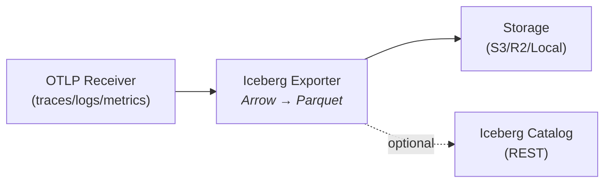

# OpenTelemetry Iceberg Exporter

An OpenTelemetry Collector exporter that writes telemetry data (traces, metrics, logs) to Apache Parquet files with optional Iceberg catalog integration.

## Features

- **Multi-signal support**: Export traces, metrics, and logs to Apache Parquet format
- **Type-specific metric schemas**: Separate optimized schemas for Gauge, Sum, Histogram, ExponentialHistogram, and Summary metrics
- **Multiple storage backends**: AWS S3, Cloudflare R2, local filesystem
- **Iceberg catalog integration**: Optional registration with REST Catalog
- **Time-based partitioning**: Configurable granularity (hourly, daily, monthly)
- **Compression**: Snappy, gzip, zstd, or none
- **OTEL-compatible schema**: Field names match OpenTelemetry proto definitions
- **Iceberg field IDs**: Parquet files include field ID metadata for Iceberg compatibility
- **Best-effort pattern**: Data durability first, catalog registration second

## Architecture



**Best-effort write pattern:**
1. Data is ALWAYS written to storage first (ensures durability)
2. Catalog registration is attempted afterward (failures are logged, not propagated)

## Project Structure

```
.
├── config.go               # Configuration types
├── exporter.go             # Main exporter logic
├── factory.go              # OTel factory functions
├── writer.go               # Write orchestration
├── path.go                 # Partition path generation
├── internal/
│   ├── arrow/              # OTEL → Arrow/Parquet conversion
│   │   ├── traces.go       # Traces converter
│   │   ├── logs.go         # Logs converter
│   │   ├── metrics.go      # Metrics converter (5 types)
│   │   ├── schema.go       # Arrow schema definitions
│   │   ├── parquet.go      # Parquet writer utilities
│   │   └── attributes.go   # Attribute conversion helpers
│   ├── iceberg/            # Iceberg abstractions
│   │   ├── catalog.go      # Catalog interface & config
│   │   ├── catalog_rest.go # REST Catalog implementation
│   │   ├── catalog_noop.go # No-op Catalog (Parquet-only mode)
│   │   ├── catalog_factory.go # Catalog factory
│   │   ├── fileio.go       # FileIO interface & config
│   │   ├── fileio_s3.go    # S3 FileIO implementation
│   │   ├── fileio_r2.go    # R2 FileIO implementation
│   │   ├── fileio_local.go # Local filesystem implementation
│   │   ├── fileio_factory.go # FileIO factory
│   │   └── http.go         # HTTP utilities for catalog communication
│   └── logger/             # Logging utilities
│       └── logger.go       # Verbosity-based logging wrapper
├── example/
│   ├── otel-config.yaml    # Example collector configuration
│   └── docker-compose.yaml # Local development setup (MinIO + Nessie)
├── builder-config.yaml     # OpenTelemetry Collector Builder config
├── Dockerfile              # Container build
└── Makefile
```

## Configuration

### Configuration Reference

#### Storage Configuration (`storage`)

| Field | Type | Required | Default | Description |
|-------|------|----------|---------|-------------|
| `type` | string | No | `s3` | Storage backend type: `s3`, `r2`, or `filesystem` |

##### S3 Storage (`storage.s3`)

Used when `storage.type` is `s3` or empty.

| Field | Type | Required | Default | Description |
|-------|------|----------|---------|-------------|
| `bucket` | string | **Yes** | - | S3 bucket name |
| `region` | string | Conditional | - | AWS region. Required if `endpoint` is not set |
| `endpoint` | string | Conditional | - | Custom S3-compatible endpoint URL (for MinIO, etc.). Required if `region` is not set |
| `access_key_id` | string | No | - | AWS access key. Uses default credential chain if empty |
| `secret_access_key` | string | No | - | AWS secret key. Uses default credential chain if empty |
| `compression` | string | No | `snappy` | Parquet compression: `none`, `snappy`, `gzip`, `zstd` |

**Path-style auto-detection:**
- AWS S3 (`*.amazonaws.com`) → virtual-hosted-style (path-style disabled)
- Google Cloud Storage (`*.googleapis.com`) → virtual-hosted-style
- MinIO, LocalStack, S3Mock hostnames → path-style enabled
- Localhost, IP addresses → path-style enabled
- Kubernetes services (`.svc`, `.internal`) → path-style enabled
- Other custom endpoints → path-style enabled (safer default)

##### R2 Storage (`storage.r2`)

Used when `storage.type` is `r2`.

| Field | Type | Required | Default | Description |
|-------|------|----------|---------|-------------|
| `account_id` | string | **Yes** | - | Cloudflare account ID |
| `bucket` | string | **Yes** | - | R2 bucket name |
| `access_key_id` | string | **Yes** | - | R2 access key |
| `secret_access_key` | string | **Yes** | - | R2 secret key |
| `compression` | string | No | `snappy` | Parquet compression: `none`, `snappy`, `gzip`, `zstd` |

##### Filesystem Storage (`storage.filesystem`)

Used when `storage.type` is `filesystem`.

| Field | Type | Required | Default | Description |
|-------|------|----------|---------|-------------|
| `base_path` | string | **Yes** | - | Base directory for storing files |
| `compression` | string | No | `snappy` | Parquet compression: `none`, `snappy`, `gzip`, `zstd` |

---

#### Catalog Configuration (`catalog`)

| Field | Type | Required | Default | Description |
|-------|------|----------|---------|-------------|
| `type` | string | **Yes** | - | Catalog type: `rest` or `none`. **Must be explicitly set** |
| `namespace` | string | No | `default` | Iceberg namespace (database) for all tables |

##### REST Catalog (`catalog.rest`)

Used when `catalog.type` is `rest`.

| Field | Type | Required | Default | Description |
|-------|------|----------|---------|-------------|
| `uri` | string | **Yes** | - | REST catalog endpoint URL |
| `warehouse` | string | No | - | Warehouse name or location (catalog-specific, e.g., `warehouse` for Nessie, `s3://bucket/warehouse` for others) |
| `token` | string | No | - | Bearer token for authentication |

##### Table Names (`catalog.tables`)

Metrics are stored in separate tables by metric type for optimal schema design.

| Field | Type | Required | Default | Description |
|-------|------|----------|---------|-------------|
| `traces` | string | No | `otel_traces` | Table name for traces |
| `logs` | string | No | `otel_logs` | Table name for logs |
| `metrics` | string | No | `otel_metrics` | Prefix for metric tables (see below) |
| `metrics_gauge` | string | No | `{metrics}_gauge` | Table name for gauge metrics |
| `metrics_sum` | string | No | `{metrics}_sum` | Table name for sum/counter metrics |
| `metrics_histogram` | string | No | `{metrics}_histogram` | Table name for histogram metrics |
| `metrics_exponential_histogram` | string | No | `{metrics}_exponential_histogram` | Table name for exponential histogram metrics |
| `metrics_summary` | string | No | `{metrics}_summary` | Table name for summary metrics |

**Note:** When `metrics` is set to `otel_metrics` (default), the actual table names will be:
- `otel_metrics_gauge`
- `otel_metrics_sum`
- `otel_metrics_histogram`
- `otel_metrics_exponential_histogram`
- `otel_metrics_summary`

Individual table names (e.g., `metrics_gauge`) override the prefix-based naming.

---

#### Partition Configuration (`partition`)

| Field | Type | Required | Default | Description |
|-------|------|----------|---------|-------------|
| `granularity` | string | No | `hourly` | Partition granularity: `hourly`, `daily`, `monthly` |
| `timezone` | string | No | `UTC` | Timezone for partition values (IANA timezone name) |

---

#### Verbosity Configuration

| Field | Type | Required | Default | Description |
|-------|------|----------|---------|-------------|
| `verbosity` | string | No | `normal` | Logging verbosity level: `basic`, `normal`, `detailed` |

**Logging behavior by verbosity level:**
- `basic`: Only Error and Warn are output (silent on success)
- `normal`: Error, Warn, and Info are output
- `detailed`: Error, Warn, Info, and Debug are output

---

#### Standard OTel Exporter Settings

| Field | Type | Required | Default | Description |
|-------|------|----------|---------|-------------|
| `timeout` | duration | No | `5s` | Export timeout |
| `sending_queue.enabled` | bool | No | `true` | Enable sending queue |
| `sending_queue.num_consumers` | int | No | `10` | Number of queue consumers |
| `sending_queue.storage` | string | No | - | Reference to file_storage extension for persistent queue |
| `retry_on_failure.enabled` | bool | No | `true` | Enable retry on failure |
| `retry_on_failure.max_elapsed_time` | duration | No | `300s` | Maximum retry duration |

---

### Configuration Examples

#### Full Example

```yaml
exporters:
  iceberg:
    # Verbosity level for exporter logging
    verbosity: normal  # "basic", "normal", "detailed"

    # Storage configuration (required)
    storage:
      type: s3  # "s3", "r2", or "filesystem"
      s3:
        region: us-east-1
        bucket: my-otel-bucket
        endpoint: ""                    # Custom endpoint for MinIO
        access_key_id: ${env:AWS_ACCESS_KEY_ID}
        secret_access_key: ${env:AWS_SECRET_ACCESS_KEY}
        compression: zstd               # snappy, gzip, zstd, none

    # Iceberg catalog configuration (required - type must be set)
    catalog:
      type: none  # "none" or "rest"
      namespace: otel
      tables:
        traces: otel_traces
        logs: otel_logs
        metrics: otel_metrics
      # REST catalog settings (when type is "rest")
      # rest:
      #   uri: http://nessie:19120/iceberg
      #   warehouse: warehouse

    # Partition configuration
    partition:
      granularity: hourly  # "hourly", "daily", "monthly"
      timezone: UTC

    # Standard OTel exporter settings
    timeout: 30s
    sending_queue:
      enabled: true
      num_consumers: 10
      # Optional: persistent queue using file_storage extension (survives restarts)
      # storage: file_storage/iceberg
    retry_on_failure:
      enabled: true
      max_elapsed_time: 300s
```

#### AWS S3
```yaml
storage:
  type: s3
  s3:
    region: us-east-1
    bucket: my-bucket
    access_key_id: ${env:AWS_ACCESS_KEY_ID}
    secret_access_key: ${env:AWS_SECRET_ACCESS_KEY}
    compression: zstd
```

#### S3-Compatible (MinIO)
```yaml
storage:
  type: s3
  s3:
    bucket: my-bucket
    endpoint: http://minio:9000
    access_key_id: ${env:MINIO_ACCESS_KEY}
    secret_access_key: ${env:MINIO_SECRET_KEY}
    compression: zstd
```

#### Cloudflare R2
```yaml
storage:
  type: r2
  r2:
    account_id: your-account-id
    bucket: my-bucket
    access_key_id: ${env:R2_ACCESS_KEY_ID}
    secret_access_key: ${env:R2_SECRET_ACCESS_KEY}
    compression: zstd
```

#### Local Filesystem (for testing)
```yaml
storage:
  type: filesystem
  filesystem:
    base_path: /tmp/otel-data
    compression: snappy
```

#### No Catalog (Parquet-only mode)
```yaml
catalog:
  type: none  # Data files only, no catalog registration
```

#### REST Catalog (Nessie, Tabular, etc.)
```yaml
catalog:
  type: rest
  namespace: otel
  rest:
    uri: http://nessie:19120/iceberg
    warehouse: s3://my-bucket/warehouse
```

#### REST Catalog with Authentication
```yaml
catalog:
  type: rest
  namespace: otel
  rest:
    uri: https://catalog.example.com/iceberg
    warehouse: s3://my-bucket/warehouse
    token: ${env:ICEBERG_TOKEN}  # Bearer token
```

#### Persistent Queue (survives collector restarts)
```yaml
extensions:
  file_storage/iceberg:
    directory: /var/lib/otelcol/iceberg-queue
    create_directory: true
    timeout: 10s
    compaction:
      on_start: true
      on_rebound: true

exporters:
  iceberg:
    # ... storage and catalog config ...
    sending_queue:
      enabled: true
      num_consumers: 10
      storage: file_storage/iceberg  # Reference to file_storage extension

service:
  extensions: [file_storage/iceberg]
  # ... pipelines ...
```

## Quick Start

### Local Development with MinIO and Nessie

```bash
# Start MinIO, Nessie, the collector, and telemetry generators
make docker-up

# View collector logs
make docker-logs

# Access MinIO console at http://localhost:9001
# Username: minioadmin, Password: minioadmin

# Access Nessie REST API at http://localhost:19120

# Stop all services
make docker-down
```

The example setup includes:
- MinIO for S3-compatible storage
- Nessie as the Iceberg REST Catalog
- OpenTelemetry Collector with the Iceberg exporter (with persistent queue)
- Telemetrygen containers generating sample traces, metrics, and logs

### With AWS S3

```bash
export AWS_REGION=us-east-1
export S3_BUCKET=your-bucket
export AWS_ACCESS_KEY_ID=your-access-key
export AWS_SECRET_ACCESS_KEY=your-secret-key

make build
./otelcol-iceberg --config=example/otel-config.yaml
```

### With Cloudflare R2

```bash
export S3_BUCKET=your-bucket
export S3_ENDPOINT=https://your-account-id.r2.cloudflarestorage.com
export AWS_ACCESS_KEY_ID=your-r2-access-key
export AWS_SECRET_ACCESS_KEY=your-r2-secret-key

make build
./otelcol-iceberg --config=example/otel-config.yaml
```

### Local Filesystem

```bash
# Modify example/otel-config.yaml to use filesystem storage:
# storage:
#   type: filesystem
#   filesystem:
#     base_path: /tmp/otel-data

make build
./otelcol-iceberg --config=example/otel-config.yaml
```

## Schema

All schemas use microsecond precision timestamps for Iceberg v1/v2 compatibility.

### Traces Schema

| Field | Type | Nullable | Description |
|-------|------|----------|-------------|
| trace_id | String | No | Trace ID (hex encoded) |
| span_id | String | No | Span ID (hex encoded) |
| trace_state | String | Yes | W3C trace state |
| parent_span_id | String | Yes | Parent span ID |
| span_flags | Int32 | No | Span flags |
| span_name | String | No | Operation name |
| span_kind | String | No | INTERNAL, SERVER, CLIENT, PRODUCER, CONSUMER |
| start_time_unix_nano | Timestamp(us) | No | Span start time |
| end_time_unix_nano | Timestamp(us) | No | Span end time |
| span_attributes | String | No | JSON-encoded span attributes |
| dropped_attributes_count | Int32 | No | Number of dropped attributes |
| events_time_unix_nano | List[Timestamp] | No | Span event timestamps |
| events_name | List[String] | No | Span event names |
| events_attributes | List[String] | No | JSON-encoded event attributes |
| events_dropped_attributes_count | List[Int32] | No | Dropped attributes per event |
| dropped_events_count | Int32 | No | Number of dropped events |
| links_trace_id | List[String] | No | Linked trace IDs |
| links_span_id | List[String] | No | Linked span IDs |
| links_trace_state | List[String] | No | Linked trace states |
| links_attributes | List[String] | No | JSON-encoded link attributes |
| links_dropped_attributes_count | List[Int32] | No | Dropped attributes per link |
| links_flags | List[Int32] | No | Link flags |
| dropped_links_count | Int32 | No | Number of dropped links |
| status_code | String | Yes | OK, ERROR, UNSET |
| status_message | String | Yes | Status description |
| duration | Int64 | No | Duration in nanoseconds (calculated) |
| service_name | String | Yes | service.name resource attribute |
| resource_attributes | String | No | JSON-encoded resource attributes |
| resource_dropped_attributes_count | Int32 | No | Resource dropped attributes |
| scope_name | String | Yes | Instrumentation scope name |
| scope_version | String | Yes | Instrumentation scope version |
| scope_attributes | String | No | JSON-encoded scope attributes |
| scope_dropped_attributes_count | Int32 | No | Scope dropped attributes |

### Logs Schema

| Field | Type | Nullable | Description |
|-------|------|----------|-------------|
| time_unix_nano | Timestamp(us) | No | Log timestamp |
| severity_number | Int32 | No | Severity (1-24) |
| severity_text | String | Yes | DEBUG, INFO, WARN, ERROR, etc. |
| body | String | No | Log message (JSON encoded) |
| log_attributes | String | No | JSON-encoded log attributes |
| dropped_attributes_count | Int32 | No | Number of dropped attributes |
| log_flags | Int32 | No | Log record flags |
| trace_id | String | Yes | Associated trace ID |
| span_id | String | Yes | Associated span ID |
| observed_time_unix_nano | Timestamp(us) | Yes | When the log was observed |
| event_name | String | Yes | Log event name |
| service_name | String | Yes | service.name resource attribute |
| resource_attributes | String | No | JSON-encoded resource attributes |
| resource_dropped_attributes_count | Int32 | No | Resource dropped attributes |
| scope_name | String | Yes | Instrumentation scope name |
| scope_version | String | Yes | Instrumentation scope version |
| scope_attributes | String | No | JSON-encoded scope attributes |
| scope_dropped_attributes_count | Int32 | No | Scope dropped attributes |

### Metrics Schemas

Metrics are stored in separate tables by type, each with an optimized schema.

#### Common Fields (all metric types)

| Field | Type | Nullable | Description |
|-------|------|----------|-------------|
| time_unix_nano | Timestamp(us) | No | Data point timestamp |
| service_name | String | Yes | service.name resource attribute |
| resource_attributes | String | No | JSON-encoded resource attributes |
| resource_dropped_attributes_count | Int32 | No | Resource dropped attributes |
| scope_name | String | Yes | Instrumentation scope name |
| scope_version | String | Yes | Instrumentation scope version |
| scope_attributes | String | No | JSON-encoded scope attributes |
| scope_dropped_attributes_count | Int32 | No | Scope dropped attributes |
| metric_name | String | No | Metric name |
| metric_description | String | Yes | Metric description |
| metric_unit | String | Yes | Unit (e.g., "ms", "bytes") |
| metric_metadata | String | Yes | JSON-encoded metric metadata |
| attributes | String | No | JSON-encoded data point attributes |
| start_time_unix_nano | Timestamp(us) | Yes | Start time for cumulative metrics |
| flags | Int32 | No | Data point flags |

#### Gauge Schema (`otel_metrics_gauge`)

Common fields plus:

| Field | Type | Nullable | Description |
|-------|------|----------|-------------|
| as_double | Float64 | Yes | Value as double |
| as_int | Int64 | Yes | Value as integer |
| exemplars_time_unix_nano | List[Timestamp] | Yes | Exemplar timestamps |
| exemplars_as_double | List[Float64] | Yes | Exemplar values (double) |
| exemplars_span_id | List[String] | Yes | Exemplar span IDs |
| exemplars_trace_id | List[String] | Yes | Exemplar trace IDs |
| exemplars_as_int | List[Int64] | Yes | Exemplar values (int) |
| exemplars_filtered_attributes | List[String] | Yes | JSON-encoded exemplar attributes |

#### Sum Schema (`otel_metrics_sum`)

Common fields plus:

| Field | Type | Nullable | Description |
|-------|------|----------|-------------|
| as_double | Float64 | Yes | Value as double |
| as_int | Int64 | Yes | Value as integer |
| is_monotonic | Boolean | No | Whether the sum is monotonic |
| aggregation_temporality | String | No | CUMULATIVE or DELTA |
| exemplars_* | ... | Yes | Same as Gauge |

#### Histogram Schema (`otel_metrics_histogram`)

Common fields plus:

| Field | Type | Nullable | Description |
|-------|------|----------|-------------|
| count | Int64 | No | Number of values |
| sum | Float64 | Yes | Sum of values |
| min | Float64 | Yes | Minimum value |
| max | Float64 | Yes | Maximum value |
| bucket_counts | List[Int64] | No | Bucket counts |
| explicit_bounds | List[Float64] | No | Bucket boundaries |
| aggregation_temporality | String | No | CUMULATIVE or DELTA |
| exemplars_* | ... | Yes | Same as Gauge |

#### Exponential Histogram Schema (`otel_metrics_exponential_histogram`)

Common fields plus:

| Field | Type | Nullable | Description |
|-------|------|----------|-------------|
| count | Int64 | No | Number of values |
| sum | Float64 | Yes | Sum of values |
| min | Float64 | Yes | Minimum value |
| max | Float64 | Yes | Maximum value |
| scale | Int32 | No | Scale factor |
| zero_count | Int64 | No | Count of zero values |
| zero_threshold | Float64 | No | Zero bucket threshold |
| positive_offset | Int32 | No | Positive buckets offset |
| positive_buckets | List[Int64] | No | Positive bucket counts |
| negative_offset | Int32 | No | Negative buckets offset |
| negative_buckets | List[Int64] | No | Negative bucket counts |
| aggregation_temporality | String | No | CUMULATIVE or DELTA |
| exemplars_* | ... | Yes | Same as Gauge |

#### Summary Schema (`otel_metrics_summary`)

Common fields plus:

| Field | Type | Nullable | Description |
|-------|------|----------|-------------|
| count | Int64 | No | Number of values |
| sum | Float64 | No | Sum of values |
| quantile_values.quantile | List[Float64] | No | Quantile values (e.g., 0.5, 0.99) |
| quantile_values.value | List[Float64] | No | Values at each quantile |

## Development

### Publish Docker Image

```sh
cat <GHCR_PAT> | docker login ghcr.io -u terakoya76 --password-stdin

make docker-build
make docker-tag
make docker-tag DOCKER_TAG=v0.142.0.5
make docker-push
make docker-push DOCKER_TAG=v0.142.0.5
```

## License

Apache-2.0
